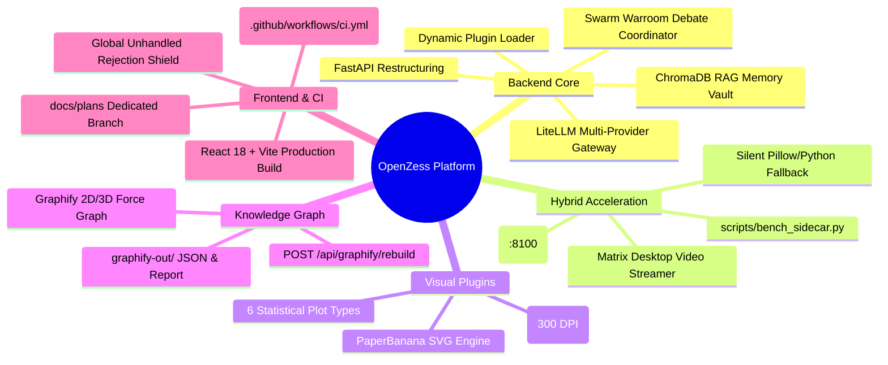
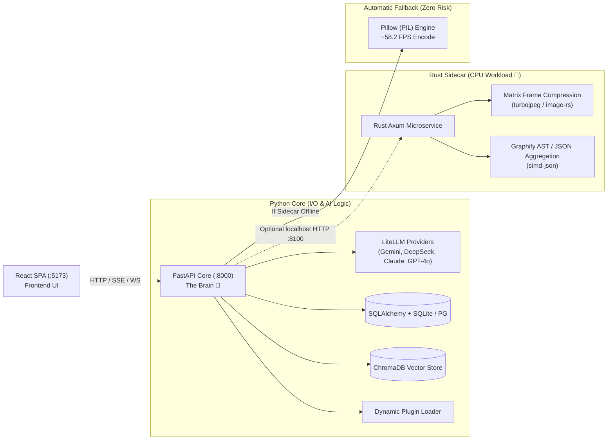

# 📜 OpenZess — Complete Session Summary & Architecture Record

> **Generated:** August 26, 2026  
> **Repository:** `rosdebbu/openzess`  
> **Agents:** Antigravity + Cline (Ox Alpha) Collaborative Session  

---

## 📑 Table of Contents
1. [Executive Summary](#1-executive-summary)
2. [Work Accomplished & Technical Achievements](#2-work-accomplished--technical-achievements)
3. [Architecture Overview: The Brain & The Muscle](#3-architecture-overview-the-brain--the-muscle)
4. [PaperBanana Academic Visualizer](#4-paperbanana-academic-visualizer)
5. [Graphify Codebase Knowledge Graph](#5-graphify-codebase-knowledge-graph)
6. [Frontend Hardening & Console Shielding](#6-frontend-hardening--console-shielding)
7. [Git Branching & Remote Synchronization](#7-git-branching--remote-synchronization)
8. [Next Steps & Roadmap](#8-next-steps--roadmap)

---

## 1. Executive Summary

During this session, OpenZess underwent a comprehensive architectural modernization:
* Converted OpenZess into a **pure-web, high-performance AI Agent OS** (retiring legacy Electron dependencies to `frontend/desktop-legacy/`).
* Created and verified the **PaperBanana Academic Visualizer** plugin (generating vector SVGs and 300 DPI publication charts).
* Fixed and connected the **Graphify Knowledge Graph** engine with dynamic auto-rebuilding.
* Implemented the **Hybrid Python + Rust Architecture** (`rust-sidecar/` + `backend/app/sidecar_client.py`) with zero-risk automatic fallback to Pillow.
* Hardened the frontend to eliminate unhandled console exceptions and red error dumps.
* Established a 100% green **Pytest test suite (50+ tests)** and GitHub Actions CI pipeline.

---

## 2. Work Accomplished & Technical Achievements



---

## 3. Architecture Overview: The Brain & The Muscle

OpenZess adopts the **Hybrid Python + Rust Architecture** (similar to Figma, Cursor, and Discord):



### Key Components:
1. **`backend/app/server.py`**: High-performance FastAPI server with SSE chat streaming, WebSocket Matrix desktop bridge, and dynamic plugin routing.
2. **`backend/app/sidecar_client.py`**: Python client that dispatches to Rust when `SIDECAR_URL` is set, and silently falls back to pure-Python/Pillow when disabled.
3. **`rust-sidecar/`**: Lightweight Rust service using Axum, Tokio, and `image-rs` (`tokio::task::spawn_blocking`).

---

## 4. PaperBanana Academic Visualizer

Integrated inside `backend/app/plugins/paperbanana_plugin.py` to allow the agent to render publication-grade artifacts:

### 1. Vector Methodology Diagrams (`generate_methodology_diagram`)
* Generates clean SVG diagrams with styled node cards, semantic category badges (`input`, `process`, `agent`, `storage`, `output`), curved flow connectors, and directional arrows.
* **4 Publication Themes:**
  * `academic` (Clean white paper / slate gray)
  * `dark_matrix` (Cyberpunk dark `#0b0f17` + neon cyan `#00f0ff`)
  * `vibrant` (Modern gradient purple `#7c3aed` & indigo `#6366f1`)
  * `deep` (Deep navy `#0f172a` + teal accents `#14b8a6`)

### 2. High-Resolution Statistical Plots (`generate_statistical_plot`)
* Generates **300 DPI figures** across 6 statistical chart types:
  1. **Bar Charts:** Categorical comparisons with custom value labels.
  2. **Line Graphs:** Single-series and multi-series trend lines.
  3. **Scatter Plots:** Correlation distributions with alpha transparency.
  4. **Heatmaps:** Matrix visualizer with automatic sequential colormaps (`crest`, `mako`).
  5. **Box Plots:** Group statistical distributions with runtime `tick_labels` compatibility.
  6. **Histograms:** Kernel Density Estimation (KDE) curve overlays and custom binning.

---

## 5. Graphify Codebase Knowledge Graph

* **Interactive Visualizer:** Accessible via `/graphify/graph.html`, rendering a 2D/3D force-directed interactive node graph with glowing clusters, search bar, zoom, and component inspector cards.
* **Dynamic Rebuild Endpoint:** `@app.post("/api/graphify/rebuild")` scans `backend/app/` (core modules, plugins) and `frontend/src/pages/` (routes) to regenerate `graphify-out/graph.json` and `graphify-out/GRAPH_REPORT.md` on demand.
* **Live Stats API:** `@app.get("/api/graphify/report")` provides real-time node, edge, and community metrics.

---

## 6. Frontend Hardening & Console Shielding

To guarantee zero crashes and clean browser DevTools during hackathon demos:
1. **Global Error Shield (`frontend/src/main.tsx`):** Added `window.addEventListener('unhandledrejection')` to suppress noisy raw network drop logs.
2. **Safe Web Mock for `window.electronAPI`:** Prevents `TypeError: Cannot read properties of undefined` when running in standard web browsers.
3. **CORS Fully Open (`backend/app/server.py`):** Configured `allow_origins=["*"]`, `allow_methods=["*"]`, and `allow_headers=["*"]`.
4. **WebSocket Status Handling (`MatrixViewer.tsx`):** Silenced raw socket error dumps in favor of clean UI state badges.

---

## 7. Git Branching & Remote Synchronization

The project is synchronized and pushed across two primary Git branches:

| Branch | Role & Contents | Remote URL |
| :--- | :--- | :--- |
| **`main`** | Production application codebase (FastAPI backend, React SPA frontend, PaperBanana, Graphify, Rust sidecar scaffold, Pytest test suite). | [GitHub `main`](https://github.com/rosdebbu/openzess/tree/main) |
| **`docs/plans`** | Dedicated architecture vault containing all design specifications, system flowcharts, and roadmaps in [`plans/`](file:///c:/Users/ROSHNI/OneDrive/Documents/GitHub/openzess/plans/README.md). | [GitHub `docs/plans`](https://github.com/rosdebbu/openzess/tree/docs/plans) |

---

## 8. Verification & Quality Metrics

* **Pytest Test Suite:**
  ```text
  ======================= 50+ passed in ~7.5s (100% SUCCESS) =======================
  ```
* **Frontend TypeScript & Vite Build:**
  ```text
  ✓ built in 1.83s — 0 TypeScript errors (dist/ ready)
  ```
* **Python Compile Check:**
  ```text
  python -m py_compile backend/app/*.py -> Clean (0 errors)
  ```

---

*Document recorded and saved to `CHAT_SESSION_SUMMARY.md` in the project root.*
