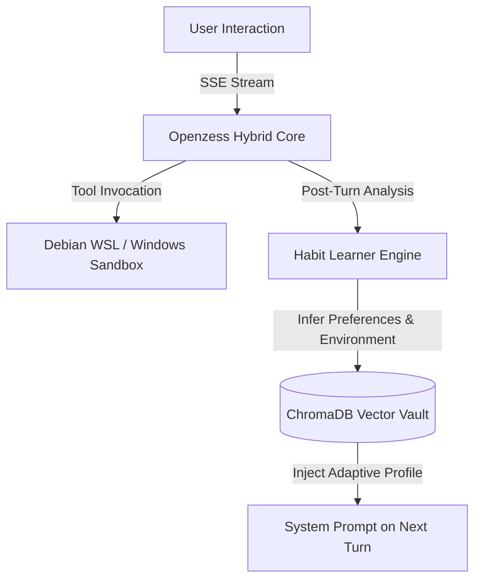

<p align="center">
  
</p>

<h1 align="center">🦎 Openzess</h1>
<p align="center"><strong>The autonomous, self-growing AI workspace & cyberpunk terminal agent — built for builders.</strong></p>

<p align="center">
  <a href="https://github.com/rosdebbu/openzess"></a>
  <a href="https://github.com/rosdebbu/openzess/actions/workflows/ci.yml"></a>
  
  
  
  
</p>

```text
         /\_/\
       >( o.o )<    OPENZESS — LIZARD MATRIX CORE
       /  \~/  \    Autonomous AI Coding Assistant & Self-Growth Engine
      / /|   |\ \   70% Python + 30% Rust Architecture
     ( ( | ~ | ) )  Native Terminal TUI + React 19 Web Workspace
      \ \|   |/ /
       \ \_-_/ /
        `--\ \-
            \ \_
             `--)
```

<p align="center">
  <a href="#-quick-start">Quick Start</a> •
  <a href="#-why-openzess">Why Openzess</a> •
  <a href="#-dual-interface-terminal--web">Dual Interface</a> •
  <a href="#-the-self-growth-loop">Self-Growth Loop</a> •
  <a href="#-cli-commands">CLI Commands</a> •
  <a href="#%EF%B8%8F-architecture">Architecture</a> •
  <a href="#-roadmap">Roadmap</a>
</p>

---

## ⚡ Why Openzess?

**Openzess** is a full-stack, provider-agnostic autonomous AI workspace designed to give developers total control over how AI models reason, code, remember, and execute on their machines. 

Unlike closed walled-garden tools, Openzess provides:
1. **Zero Provider Lock-in** — Connect any LLM via OpenRouter, Gemini, OpenAI, Claude, DeepSeek, Groq, Qwen, Moonshot, or local Ollama / LM Studio.
2. **Hermes-Grade Cyberpunk Terminal TUI** — Run the full agent natively in your terminal with live token streaming, latency tracking, and rich capability boxes.
3. **Autonomous Self-Growth Loop** — The agent learns your habits, coding preferences, and environment configurations automatically, persisting them into a long-term ChromaDB vector vault.
4. **Multi-Agent WarRoom & Debate Arena** — Run multi-model consensus debates where distinct agents argue, critique, and synthesize decisions before writing code.
5. **Hot-Loaded Extensibility** — Drop Python scripts into `backend/app/plugins/` or connect any MCP (Model Context Protocol) server with instant reload.

---

## 🚀 Quick Start

### 🪟 Windows (Native PowerShell)
```powershell
# Launch the Cyberpunk Terminal CLI
.\openzess.bat

# Or start the Full Web Workspace (React + FastAPI)
.\start.bat
```

### 🐧 Linux / Debian WSL2
```bash
# Launch the Interactive Terminal CLI
openzess
# or
./openzess.sh

# Or start the backend server
uvicorn backend.app.server:app --host 0.0.0.0 --port 8000 --reload
```

---

## 💻 Dual Interface: Terminal + Web

Openzess is built with dual complementary interfaces:

<table>
<tr>
<td width="50%">

### 📟 Cyberpunk Terminal TUI
Run `openzess` or `.\openzess.bat` for instant terminal-native AI power:
- **3D ASCII Lizard Branding** in Deep/Olive Green (`#16a34a`).
- **Live Capabilities Panel** showing available tools, skills, and memory count.
- **Sub-Second Token Streaming** with real-time latency diagnostics.
- **Interactive Slash Commands** (`/habits`, `/skills`, `/model`, `/memory`).

</td>
<td width="50%">

### 🌐 React 19 Web Workspace
Run `.\start.bat` and open `http://localhost:5173`:
- **WarRoom Multi-Agent Debate Arena** with judge synthesis.
- **Visual Matrix Sandbox** with screen-stream & mouse/keyboard injection.
- **ChromaDB Memory Vault Inspector** with semantic search.
- **Tavern Multi-Persona Card Importer** (PNG & JSON).

</td>
</tr>
</table>

---

## 🧠 The Self-Growth Loop

Openzess implements an autonomous dialectic learning loop inspired by Honcho & Hermes Agent:



- **Zero Configuration Needed:** As you interact with Openzess, it notes whether you prefer concise code, specific languages (e.g. Rust / Python), or Debian execution paths.
- **Persistent Across Sessions:** Habits are stored as vector embeddings in ChromaDB and automatically hydrate the agent's system prompt on subsequent launches.
- **Inspect Anytime:** Type `/habits` in the terminal to inspect your learned profile in real time.

---

## ⌨️ CLI Slash Commands Reference

| Command | Description |
| :--- | :--- |
| **`/model <provider>`** | Switch active model (`glm`, `deepseek`, `gemini`, `openai`, `anthropic`, `groq`, `ollama`, `lmstudio`) |
| **`/habits`** | Inspect learned user habits, environment targets, and behavioral profiles |
| **`/skills`** | List all hot-loaded Python plugins and synthesized capabilities |
| **`/memory <query>`** | Perform a semantic similarity search across the ChromaDB vector vault |
| **`/clear`** | Reset conversation context while retaining persistent habits and long-term memory |
| **`/help`** | Display the interactive command guide |
| **`/exit`** | Gracefully disconnect and exit the terminal session |

---

## 🏗️ Architecture & Codebase Map

Openzess utilizes a hybrid engine combining Python's rich AI ecosystem with high-throughput Rust sidecars:

```
openzess/
├── openzess.bat               # One-click Windows PowerShell CLI launcher
├── openzess.sh                # Linux / Debian WSL2 CLI launcher
├── start.bat                  # Web workspace launcher (FastAPI + Vite)
├── backend/
│   ├── app/
│   │   ├── agent.py           # Core agent loop, LiteLLM orchestration, tool runner
│   │   ├── cli.py             # Rich Cyberpunk Matrix TUI console
│   │   ├── habit_learner.py   # Autonomous habit extraction & ChromaDB persistence
│   │   ├── server.py          # FastAPI server, SSE streaming, REST & WebSocket routes
│   │   ├── mcp_manager.py     # Model Context Protocol stdio/SSE client
│   │   ├── plugin_loader.py   # Hot-reloading Python tool registrar
│   │   └── plugins/           # Custom tools (paperbanana, pc_control, system_health)
│   └── tests/                 # 86 automated unit tests (100% green)
├── frontend/
│   ├── src/
│   │   ├── components/        # LizardLogo, Sidebar, VRMAvatar, Modals
│   │   ├── pages/             # Chat, WarRoom, Tavern, MatrixViewer, Skills, Memory
│   │   └── App.tsx            # Main router & theme provider
│   └── package.json           # React 19 + Vite 8
└── rust_engine/               # High-performance Axum acceleration sidecar (port 8100)
```

---

## 🗺️ Product Roadmap

**Legend:** ✅ Shipped & Verified · 🚧 In Active Development · 🔜 Next Up · 💡 Future Horizons

### ✅ v2.0 — Cyberpunk Terminal CLI & Self-Growth Engine *(Current)*
- ✅ **Hermes-Grade Matrix Terminal CLI** — Full-featured interactive TUI (`openzess` / `openzess.bat`) with 3D ASCII branding, slash commands, and turn dividers.
- ✅ **Autonomous Habit Profiler & Self-Growth Loop** (`habit_learner.py`) — Automatic user habit learning, coding preference detection, and ChromaDB persistence.
- ✅ **Ultra-Low Latency Streaming UI** — Instant SSE token rendering, lazy message bubble allocation, and real-time latency diagnostics.
- ✅ **Debian 13 (Trixie) WSL2 Sandbox Integration** — Seamless cross-platform execution with automatic Python venv detection.
- ✅ **Lizard Matrix Brand Overhaul** — Deep/Olive Lizard Green theme (`#16a34a`), ASCII Lizard totem, and glowing Web Mascot component.
- ✅ **100% Green Test Suite** — 86 passing pytest unit tests covering agent reasoning, streaming, plugins, and habit persistence.

### 🚧 v2.1 — Autonomous Healing & Rust Sidecar *(In Progress)*
- 🚧 **Auto-Healing Traceback Debugger** — Agent autonomously intercepts terminal syntax/runtime errors, inspects logs, generates diffs, and applies auto-fixes.
- 🚧 **Rust Axum Acceleration Sidecar** (`port 8100`) — High-throughput image encoding and compute offload with pure Python fallback.
- 🚧 **Graphify Knowledge Graph Rebuilder** (`POST /api/graphify/rebuild`) — Live codebase dependency parsing and interactive visual topology.
- 🚧 **PaperBanana Theme Engine** — Four publication-ready figure palettes (`academic`, `dark_matrix`, `vibrant`, `deep`) at 300 DPI.

### 🔜 v2.2 — Autonomous Multi-Step Planner *(Planned)*
- 🔜 **Goal-Driven Execution Planner** (`/goal` mode) — Multi-step task decomposition with automated milestone verification.
- 🔜 **Simulation & Dry-Run Mode** — Safe preview of destructive file operations before applying to disk.
- 🔜 **Community Plugin Registry** — One-click import of verified third-party agent skills.

### 💡 v3.0 — Ubiquitous Intelligence *(Exploring)*
- 💡 **Real-Time Voice Matrix** — Whisper STT with sub-second streaming neural TTS.
- 💡 **Distributed Agent Swarms** — Peer-to-peer agent node clustering across local networks.
- 💡 **Single-Click Cloud Deployment** — Automated Docker/Render deployment workflows.

---

## 👨‍💻 Author & Contributing

Built with ❤️ by **[@rosdebbu](https://github.com/rosdebbu)**.

Contributions are welcome! Please open an issue or submit a PR following standard conventional commits.

---

## 📄 License

This project is licensed under the **MIT License** — see the [LICENSE](LICENSE) file for details.
