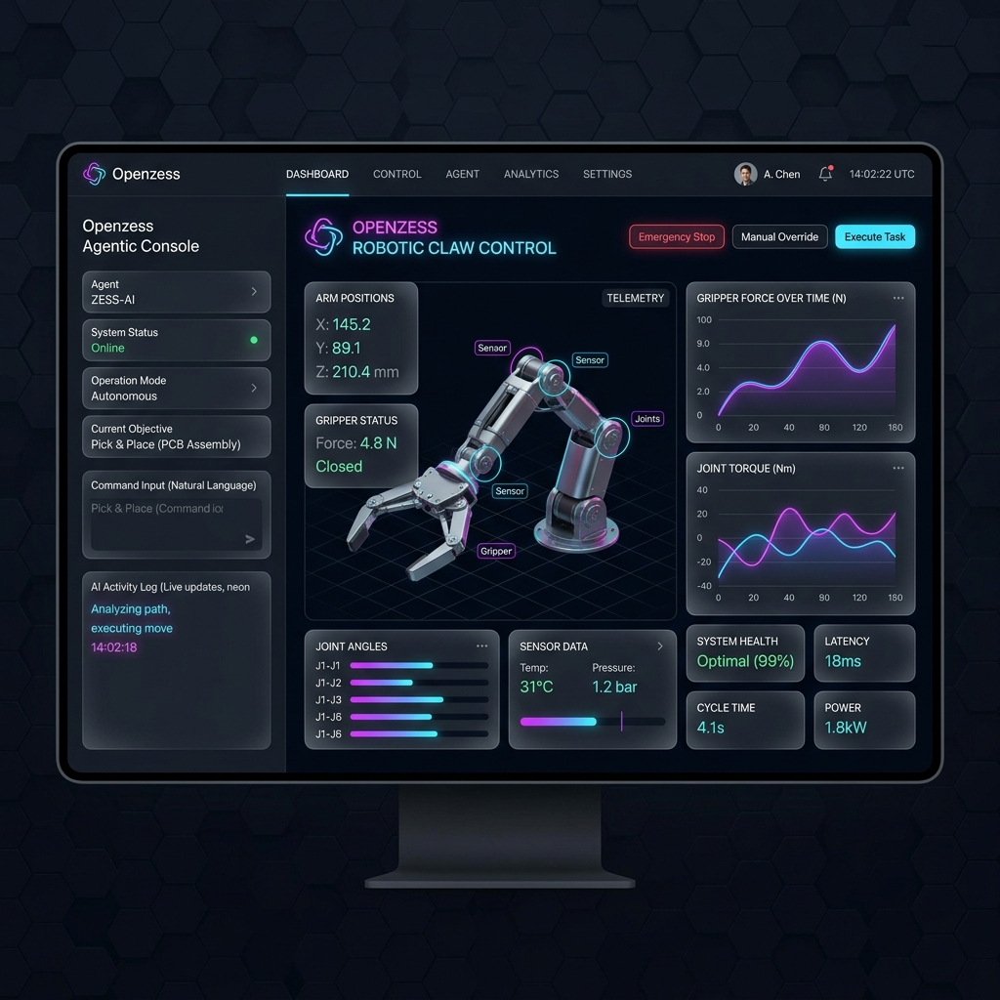

# 🛸 Openzess Frontend Web Interface

<p align="center">
  
  
  
</p>

Welcome to the **Frontend Layer** of the Openzess robotics platform. This directory houses the modern, high-performance web interface designed for real-time control, monitoring, and orchestration of **OpenClaw** robotic systems.

---

## 🎨 Design Vision & UI Mockup

We envision the Openzess dashboard to be premium, responsive, and data-rich. Below is our target design implementation—a sleek, dark-mode command center integrating telemetry readouts and AI-agent interactions.

<p align="center">
  
</p>
<p align="center"><em>Target Future UI Concept: Glassmorphism, Neon Accents, and Real-Time Agentic Control.</em></p>

---

## 📊 System Architecture Graph

This Mermaid graph outlines how the frontend React application communicates with the hardware controllers and agent systems in the broader Openzess stack.

```mermaid
graph TD
    subgraph Frontend [React Web UI]
        Dashboard[Dashboard Components]
        VideoFeed[Live Camera Stream]
        AgentChat[Agent Interface]
        Telemetry[Telemetry Charts]
    end

    subgraph Middleware [API Layer]
        WebSocket((WebSocket Gateway))
        REST((REST Server))
    end

    subgraph Backend [Openzess Core Layer]
        AgentDB[(Knowledge Base)]
        AgentLogic[AI Action Logic]
        HardwareControl[Python Robotic Controller]
    end

    subgraph Hardware [Physical Build]
        OpenClaw((OpenClaw Hardware))
    end

    Dashboard <--> |HTTP Requests| REST
    AgentChat <--> |HTTP Requests| REST
    VideoFeed <-- |Streams| WebSocket
    Telemetry <-- |Pub/Sub Metrics| WebSocket

    REST <--> AgentLogic
    WebSocket <--> HardwareControl
    AgentLogic <--> AgentDB
    AgentLogic --> |Commands| HardwareControl
    HardwareControl <--> |Serial/TCP| OpenClaw

    classDef react fill:#20232A,stroke:#61DAFB,stroke-width:2px,color:white;
    classDef python fill:#3776AB,stroke:#FFD43B,stroke-width:2px,color:white;
    classDef hardware fill:#0b3d17,stroke:#2ea043,stroke-width:2px,color:white;

    class Frontend react;
    class Backend python;
    class Middleware python;
    class Hardware hardware;
```

---

## 🚀 Getting Started

To get the frontend running locally for development or testing:

### Prerequisites
Make sure you have [Node.js](https://nodejs.org/) (v16+ or v18+) installed.

### 1. Install Dependencies
```bash
npm install
```

### 2. Start the Development Server
```bash
npm run dev
```
The server will start on `http://localhost:5173` (by default) with fast HMR enabled.

---

## ☁️ Cloud Deployment Strategies

It is absolutely possible to make the Matrix View accessible online from anywhere in the world! Since you are exposing a raw desktop connection and robotics hardware, Openzess provides two supported methods to go online securely:

### 1. The Quick Way: Cloud Tunnels (Ngrok / Cloudflare)
If you just want to access your local machine's Matrix from your phone or a laptop at a coffee shop, you can use a secure tunnel.

* **How it works:** You run a free tool like Ngrok on Windows, which generates a public URL (e.g., `https://my-robot.ngrok-free.app`). 
* Because the Matrix relies on WebSockets on port `6080`, you would simply tell Ngrok to forward that port: `ngrok http 6080`.
* You then update your React Frontend to connect to `ws://my-robot.ngrok-free.app` instead of `ws://localhost:6080`!

### 2. The Production Way: Cloud Virtual Machines (AWS / DigitalOcean)
If you want the Openzess system running 24/7 independently of your local computer:

* You rent an Ubuntu server (Droplet/EC2) in the cloud.
* You drop the entire Openzess folder onto the server and just run the exact same `start_wsl.sh` script! (Since Cloud servers *are* natively Linux, the script works perfectly).
* You would then access the server's public IP address via your local browser.

---

## 💡 Ideas for Implementation (Next Steps)

To truly make this a next-generation robotics platform, here are our planned implementation ideas and roadmap milestones for the frontend:

### Phase 1: Core Fundamentals
- [ ] **WebSockets Integration:** Transition telemetry polling to pure WebSockets for zero-latency data reporting from the Python backend.
- [ ] **Dynamic 3D Canvas:** Implement `Three.js` or `React-Three-Fiber` to render a live, digital twin of the OpenClaw mimicking physical movements in real-time.

### Phase 2: Agent Autonomy & AI UX
- [ ] **Agentic Console Window:** A dedicated split-pane view (refer to the mockup above) where users can issue natural language commands directly to the `agent.py` backend (e.g., *"Pick up the red cube and place it softly"*).
- [ ] **J.A.R.V.I.S Voice Integration:** Implement the Web Speech API (or OpenAI Whisper) on the frontend so you can dictact voice commands directly from your phone's microphone to open files, close apps, and control the system hands-free!
- [ ] **Auto-Generated Action Logs:** Real-time logging of the AI agent's internal "thought process," parsed cleanly using markdown formatting.

### Phase 3: Hardware Tuning & Extensibility
- [ ] **Drag-and-Drop Workflow Builder:** Implement `React Flow` to allow users to visually script multi-step robotic grip sequences (e.g., Open -> Rotate 90 -> Wait -> Close at 50% force).
- [ ] **Gamepad API Support:** Connect Xbox/PlayStation controllers directly via the browser for manual override and joystick-based robotic arm operation.

---

## 🤝 Need to touch the Backend/Core?
If you're looking for the Python intelligence layer, core API endpoints, or overarching documentation, please head over to the [Root README](../README.md).
