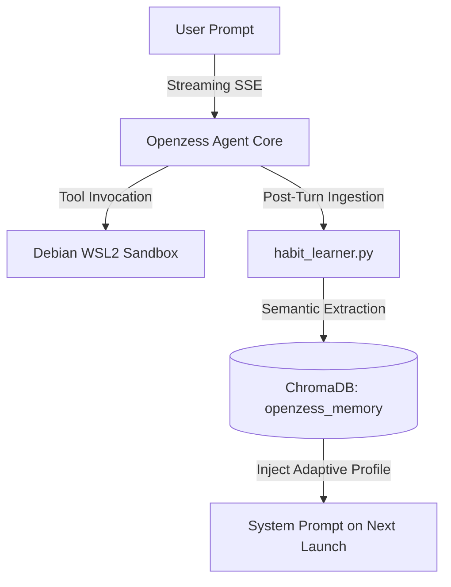

# 🧠 Habit Learner & Self-Growth Engine

Openzess features an autonomous behavioral learning loop inspired by **Honcho** & **Hermes Agent**.

Instead of requiring manual prompt engineering, Openzess automatically observes your conversation turns, extracts your coding style, environment preferences, and workflows, and stores them in a long-term ChromaDB vector vault.

---

## 🔄 How the Learning Loop Works



---

## 🎯 What Gets Learned Automatically?

1. **Language & Architecture Preferences:**
   * Preferred languages (e.g. *Rust for backend performance*, *TypeScript + React for UI*).
2. **Response & Communication Styles:**
   * Conciseness, technical depth, formatting requirements.
3. **Execution Environment:**
   * Target sandbox (e.g. *Debian 13 WSL2 user: rossdeb*), shell preferences, and compiler flags.

---

## 🔍 Inspecting Your Profile

You can inspect your learned behavioral profile at any time in the terminal CLI:

```bash
❯ /habits
```

Output:
```text
🧠 Learned User Habits & Behavioral Profile:
  • Preferred Language: Prefers Rust for high-performance modules and low latency.
  • Execution Environment: Prefers executing bash commands inside Debian WSL2 (user: rossdeb).
  • Response Style: Prefers concise, direct answers with actionable code.
```

---

## 🛠️ Programmatic API

You can also record or inspect habits via Python:

```python
from backend.app import habit_learner

# Manually record or update a habit
habit_learner.record_habit("coding_style", "Prefers functional TypeScript with strict typing.")

# Retrieve all stored habits
habits = habit_learner.get_all_habits()
```
