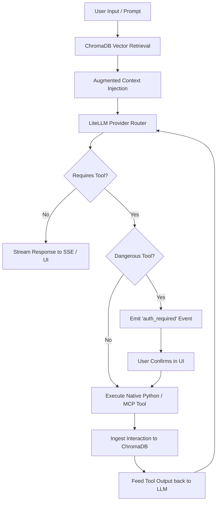

# OpenZess — Agent & Swarm Architecture

A deep technical blueprint of how **OpenZess** handles single-agent reasoning, long-term memory, and multi-agent swarms.

---

## 🧠 Core Agent Anatomy (`OpenzessAgent`)

The core agent (`backend/app/agent.py`) is designed around a multi-provider execution loop:

---

## ⚔️ Swarm Debate Arena (`SwarmManager`)

The Swarm Manager (`backend/app/swarm_manager.py`) coordinates multi-model debates across distinct cognitive personas:

* **Lead Strategist:** Proposes the high-level architecture and system breakdown.
* **Devil's Advocate (Critic):** Aggressively tests assumptions, vulnerabilities, and edge cases.
* **Performance Optimizer:** Evaluates token latency, algorithmic complexity, and scaling limits.
* **Consensus Judge:** Synthesizes the debate into a finalized, actionable consensus.

---

## 🔌 Tool Ecosystem
1. **Dynamic Python Plugins:** Hot-loaded from `backend/app/plugins/` using `@plugin_registry.register`.
2. **PaperBanana Visualizer:** Vector SVG methodology diagrams and 300 DPI matplotlib/seaborn charts.
3. **Desktop Matrix Control:** Native PyAutoGUI & Xvfb mouse/keyboard/screen automation.
4. **Model Context Protocol (MCP):** Stdio JSON-RPC client connecting external MCP tools.
