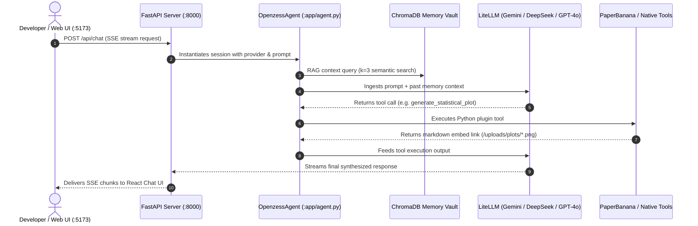

# OpenZess — Codebase & Project Structure

An overview of the complete directory layout, system modules, and dataflow across OpenZess.

---

## 🗂️ High-Level Directory Map

```text
openzess/
├── backend/                  # FastAPI Core, Agent Runtime, & Python Ecosystem
│   ├── app/                  # Application Package
│   │   ├── server.py         # Main FastAPI App, WebSocket & REST endpoints
│   │   ├── agent.py          # OpenzessAgent core (LiteLLM, RAG, Native Tools)
│   │   ├── database.py       # SQLite / PostgreSQL ORM layer
│   │   ├── swarm_manager.py  # Multi-Agent Swarm Debate coordinator
│   │   ├── mcp_manager.py    # Model Context Protocol stdio client
│   │   ├── plugin_loader.py  # Dynamic Python plugin hot-reloader
│   │   ├── plugins/          # Native tools (PaperBanana, PC Control, System Health)
│   │   ├── background_workers.py # Watchdog & APScheduler cron jobs
│   │   ├── telegram_worker.py    # Remote Telegram bridge
│   │   └── discord_worker.py     # Remote Discord bridge
│   ├── tools/                # Standalone CLI tools & DB migrations
│   ├── tests/                # Pytest unit & integration test suites
│   └── requirements.txt      # Python dependencies
│
├── frontend/                 # Modern React + Vite Single Page Application
│   ├── src/
│   │   ├── pages/            # View routes (Chat, DebateArena, Graphify, etc.)
│   │   ├── components/       # UI Components (Sidebar, ModelSelector, Modals)
│   │   ├── contexts/         # ThemeContext, ToastContext
│   │   └── assets/           # Brand assets, logos, and vector icons
│   ├── desktop-legacy/       # Archived Electron desktop shell
│   └── package.json          # Node.js dependencies & scripts
│
├── graphify-out/             # Interactive Codebase Knowledge Graph & Reports
│   ├── graph.html            # 2D/3D Force-Directed visualizer
│   ├── graph.json            # Extracted node & link dataset
│   └── GRAPH_REPORT.md       # Structural audit & god node analysis
│
├── uploads/                  # Generated Artifacts & Static Media
│   ├── diagrams/             # PaperBanana vector SVGs
│   └── plots/                # High-DPI (300 DPI) scientific figures
│
├── plans/                    # System specifications, blueprints, and roadmaps
├── scripts/                  # Shell utilities (WSL matrix, Xvfb tests)
├── start.bat                 # One-click Windows development bootstrapper
└── docker-compose.yml        # PostgreSQL & containerized services
```

---

## 🔄 Runtime Flow


