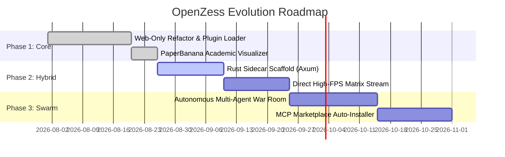

# OpenZess — Strategic Product & Engineering Roadmap

This document outlines key technical milestones, feature objectives, and architectural evolution tracks for OpenZess.

---

## 🗺️ Milestone Overview

---

## 🎯 Phase Breakdown

### ✅ Phase 1: Foundation & Web-First Architecture (Completed)
- [x] Restructure backend into clean `backend/app/` module with relative imports.
- [x] Retire Electron shell to `frontend/desktop-legacy/` in favor of pure-web React SPA.
- [x] Integrate **PaperBanana** publication visualizer (SVGs + 300 DPI statistical plots).
- [x] Implement comprehensive 44-test Pytest suite and GitHub Actions CI.
- [x] Add interactive **Graphify** knowledge graph explorer (`/graphify/graph.html`).

### ⚡ Phase 2: Hybrid Python + Rust Acceleration (In Progress)
- [ ] Implement Rust Axum sidecar (`rust-sidecar/`) for CPU-bound aggregation.
- [ ] Add `sidecar_client.py` with automatic pure-Python fallback.
- [ ] Direct high-framerate WebSockets for Matrix Desktop streaming (`turbojpeg-rs`).
- [ ] Benchmark latency and memory comparisons in `plans/bench-results.md`.

### 🤖 Phase 3: Autonomous Swarms & Extensibility (Upcoming)
- [ ] Enhanced Swarm War Room with live branching debates and auto-voting judge.
- [ ] One-click MCP Marketplace server install and auto-configuration.
- [ ] Cross-platform precompiled release binaries for Windows, Linux, and macOS.
