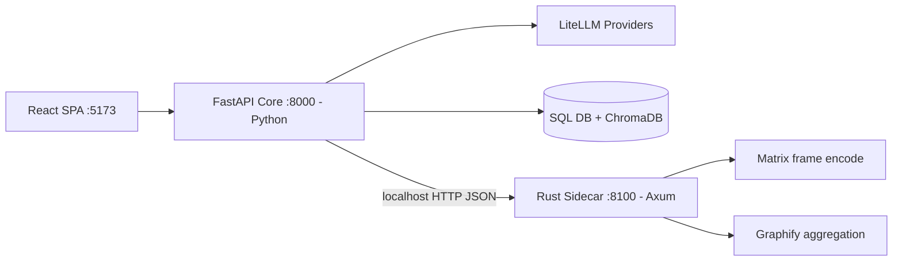

# Openzess — Hybrid Python + Rust Architecture Plan

> Status: **Implemented (flag-gated)** · Last updated 2026-08-25

## Decision

Keep the **Python FastAPI core** (agent, LLM orchestration, DB, plugins) as the brain 🧠 and add an
optional **Rust sidecar service** as the muscle 💪 for stateless CPU-bound workloads.
Both run as separate local processes communicating over plain HTTP/JSON on localhost.

## Why hybrid

- ✅ Zero risk to the working product — agent core untouched; every call site falls back silently.
- ✅ Real Rust benefit only where profiling shows CPU work (frame encoding, graph aggregation).
- ✅ Incremental adoption behind one env flag (`SIDECAR_URL`).
- ⚠️ Cost: two toolchains + IPC overhead on small payloads — mitigated by flags + fallback.

## Topology

## Implemented components

| Component       | File                                                              | Notes                                                                                               |
| --------------- | ----------------------------------------------------------------- | --------------------------------------------------------------------------------------------------- |
| Rust sidecar    | [rust-sidecar/](../rust-sidecar/README.md)                        | Axum; `/health`, `/image/encode`, `/graphify/report`; unit-tested imaging module                    |
| Python client   | [backend/app/sidecar_client.py](../backend/app/sidecar_client.py) | `encode_image[_async]`, `aggregate_graph_via_sidecar[_async]`; silent Pillow/Python fallback        |
| Matrix stream   | [server.py](../backend/app/server.py) `send_frames`               | Encoding moved off the event loop (`asyncio.to_thread`) — also fixes original blocking-Pillow stall |
| Graphify report | [server.py](../backend/app/server.py) `get_graphify_report`       | Sidecar stats first, identical pure-Python fallback                                                 |
| Launcher        | [start.bat](../start.bat)                                         | Builds + starts sidecar automatically when cargo exists                                             |
| Benchmark       | [scripts/bench_sidecar.py](../scripts/bench_sidecar.py)           | Pillow vs Rust latency/FPS verdict                                                                  |

## Activation

1. Install rustup (<https://rustup.rs>) or build inside WSL2 Linux.
2. `cd rust-sidecar && cargo test && cargo build --release`
3. Set `SIDECAR_URL=http://127.0.0.1:8100` in `.env` (see [.env.example](../.env.example)).
4. Optional proof: `python scripts/bench_sidecar.py`.

With the flag unset — the default — behavior is 100% pure-Python and byte-identical to before.

## Environment blocker found on this machine (2026-08-25)

Windows **Smart App Control is in Evaluation mode**
(`HKLM\SYSTEM\...\Control\CI\Policy\VerifiedAndReputablePolicyState = 1`).
Every freshly compiled unsigned `.exe` is blocked at execution (WinError 4551),
so neither cargo build-scripts nor the sidecar binary can run natively here.
Additionally: MSVC Build Tools are absent, and the GNU toolchain lacks `dlltool.exe`;
WSL2 is present but has no distro installed.

**Activation paths:** (a) `wsl --install -d Debian` then rustup + `cargo run --release`
inside WSL (Linux binaries bypass SAC); (b) distribute signed release binaries;
(c) run on machines without SAC enforcement. Until then the app runs identically
in pure-Python mode — by design.

## Success criteria

- Sidecar output schema-equivalent to Python fallback (contract parity).
- Measurable latency win at realistic frame sizes before enabling the flag in production.
- Zero regression when the sidecar dies mid-run (fallback proven by design + tests).
