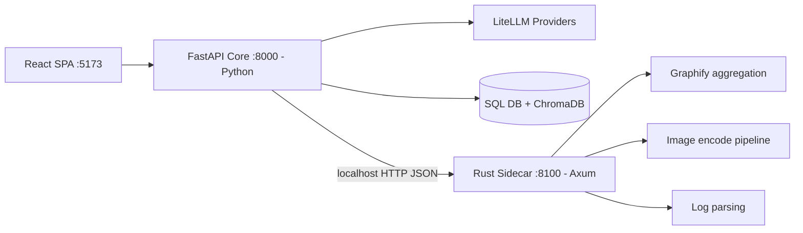

# Openzess — Hybrid Python + Rust Architecture Plan

## Decision

Keep the **Python FastAPI core** (agent, LLM orchestration, DB, plugins) and add a
**Rust sidecar service** for selected stateless, CPU-bound workloads. Both run as
separate local processes communicating over plain HTTP/JSON on localhost.

## Why hybrid (opinion)

- ✅ Zero risk to the working product — the agent core stays untouched.
- ✅ Real Rust benefit where profiling shows CPU work (JSON/graph aggregation,
  image encoding for the Matrix stream, log parsing).
- ✅ Incremental: each workload migrates independently behind a feature flag.
- ✅ Learning path: Rust enters the codebase without a rewrite bet.
- ⚠️ Cost: two toolchains (cargo + pip), IPC serialization overhead on small
  payloads, and a second service to operate. Mitigated by flags + fallback.

## Target topology

## Workload candidates (ranked)

1. **Graphify report/aggregation** — parse and aggregate `graphify-out/*.json`
   caches into report stats. Pure data crunching, trivially stateless.
2. **Matrix stream frame encoding** — raw BGRA captures → JPEG/PNG via the
   `image` crate instead of Pillow on the hot WebSocket path.
3. **Log/watchdog parsing** — bulk regex extraction over large log files.

Non-candidates: agent loop, LiteLLM calls, ChromaDB memory, plugins (all
I/O-bound or Python-native).

## API contract (v0)

Sidecar base URL: `http://127.0.0.1:8100`

| Endpoint           | Method | Purpose                                              |
| ------------------ | ------ | ---------------------------------------------------- |
| `/health`          | GET    | liveness + version                                   |
| `/graphify/report` | POST   | body: `{ "paths": [..] }` → aggregated stats JSON    |
| `/image/encode`    | POST   | raw bytes + format/quality → encoded bytes           |
| `/log/parse`       | POST   | body: `{ "path": .., "pattern": .. }` → matches JSON |

## Integration pattern (Python side)

- New module `backend/app/sidecar_client.py` — thin HTTP client with timeout.
- Env flag in `.env`: `SIDECAR_URL=http://127.0.0.1:8100` (empty = disabled).
- Every call site: try sidecar → on any error fall back to existing pure-Python
  implementation. Behavior identical either way.

## Phases

### Phase 1 — Sidecar scaffold

- `rust-sidecar/` crate: Axum + Tokio + serde + tracing.
- `/health` endpoint; Cargo.toml pinned deps; `rust-sidecar/README.md`.

### Phase 2 — Python client + flags

- `sidecar_client.py`, `.env.example` entry, config plumbing in `server.py`.
- Fallback wrappers around current implementations.

### Phase 3 — First migration: Graphify

- Implement `/graphify/report` in Rust (serde_json aggregation).
- Wire [`/api/graphify/report`](../backend/app/server.py) through the client.

### Phase 4 — Benchmark

- Script `scripts/bench_sidecar.py`: same real dataset through both paths;
  record latency/throughput/memory. Keep results in `plans/bench-results.md`.

### Phase 5 — Ops + docs

- `start.bat` and `scripts/start_wsl.sh` optionally launch sidecar
  (`cargo run --release`) when cargo is available.
- docker-compose profile for the sidecar.
- Docs page in `openzess-docs/docs/guide/` describing the hybrid setup.

## Exit criteria / success metrics

- Sidecar path produces byte-equivalent (or schema-equivalent) output vs Python.
- Measurable latency win on the migrated workload at realistic data sizes;
  otherwise keep the flag off and retain the code as an experiment.
- No regression when sidecar is stopped mid-run (fallback proven by test).

## Risks & mitigations

| Risk                                  | Mitigation                                        |
| ------------------------------------- | ------------------------------------------------- |
| Small-payload IPC overhead eats gains | Batch requests; benchmark before migrating more   |
| Contributor needs Rust toolchain      | Sidecar optional; app fully works without it      |
| Duplicated logic drifts               | Contract tests asserting parity between paths     |
| Windows/WSL build friction            | Ship prebuilt release binaries per platform later |
